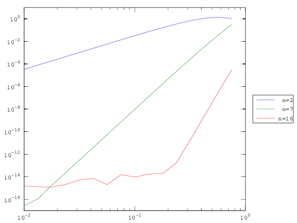
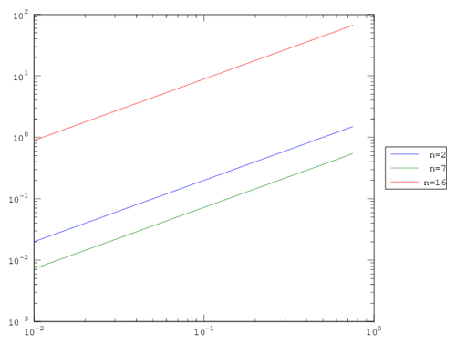
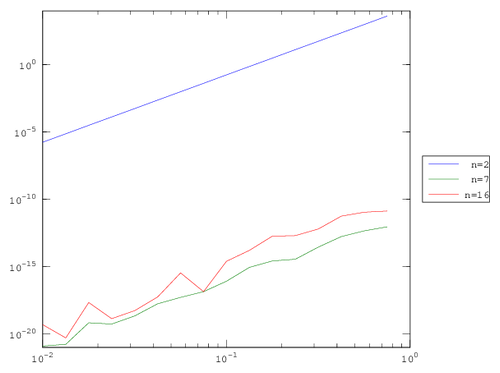
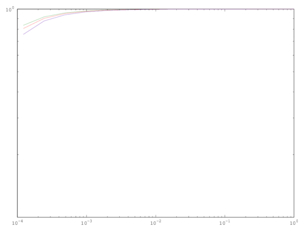
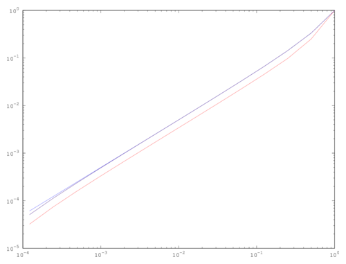
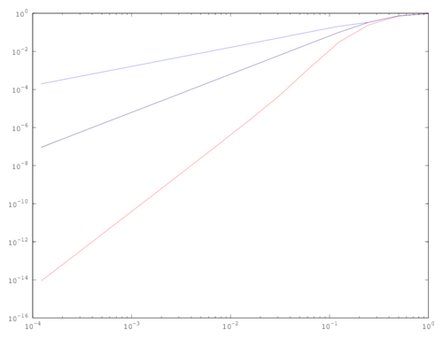

# Math 578 Assignment 1 

## Dan Anderson - 260457325 - Fall 2016

## Question 2

### TODO

- plot
- table
	- transposes
- order
- discussion

### Signum function

For all polynomial degrees, the order of error was constant with respect to h.
This is reasonable; the discontinuity at 0 affects the $sup$ norm strongly. 

Columns 1 through 8:

1.96952   1.96952   1.96952   1.96952   1.96952   1.96952   1.96952   1.96952
0.95742   0.95742   0.95742   0.95742   0.95742   0.95742   0.95742   0.95742
1.97611   1.97611   1.97611   1.97611   1.97611   1.97611   1.97611   1.97611

Columns 9 through 16:

1.96952   1.96952   1.96952   1.96952   1.96952   1.96952   1.96952   1.96952
0.95742   0.95742   0.95742   0.95742   0.95742   0.95742   0.95742   0.95742
1.97611   1.97611   1.97611   1.97611   1.97611   1.97611   1.97611   1.97611

	+-----------------------------------------------------------------------------+
	|   1                                                                         |
	| 10 ++---------+-----+---+--+--+--+-++-+----------+-----+---+--+--+--+-++++  |
	|    +--------------------------------------------------------------------++  |
	|    |                                                                    |+  |
	|    |                                                                    |+  |
	|    |                                                                    |+  |
	|    |                                                                    |+  |
	|    |                                                                    ||  |
	|    |---+----+---+----+---+---+----+---+---+----+---+----+---+---+----+  |+  |
	|   0|                                                                    ||  |
	| 10 |+                                                                   |+  |
	|    |---+----+---+----+---+---+----+---+---+----+---+----+---+---+----+  |+  |
	|    |                                                                    |+  |
	|    |                                                                    |+  |
	|    |                                                                    |+  |
	|    |                                                                    |+  |
	|    |                                                                    ||  |
	|    |                                                                    |+  |
	|    |                                                                    ||  |
	|  -1|                                  +                                 |+  |
	|10  +-2----------------------------------1-------------------------------++0 |
	|   10                                 10                                 10  |
	+-----------------------------------------------------------------------------+

### Sine

The error for sine showed good agreement with the theory, until it reached our 
effective machine epsilon around $10^{-16}$. The order of the error was about
$h^3$, $h^9$, and $h^17$ for the degree 2, 7, and 16 polynomial interpolations.
Note that the degree 16 converged rapidly the machine epsilon, so we needed to 
toss out many small h-values to obtain the 'true' order of error.

	name = sin
	slope =  2.7211
	slope =  8.6071
	slope =  4.2321
	errors =

	 Columns 1 through 6:

	   1.2809e+00   1.2917e+00   8.8581e-01   4.8614e-01   2.3751e-01   1.0859e-01
	   7.6976e-02   9.2269e-03   8.9211e-04   7.6998e-05   6.2473e-06   4.8985e-07
	   4.6168e-07   4.2350e-09   3.5580e-11   2.8511e-13   3.7748e-15   8.8818e-16

	 Columns 7 through 12:

	   4.7898e-02   2.0716e-02   8.8621e-03   3.7680e-03   1.5966e-03   6.7525e-04
	   3.7685e-08   2.8684e-09   2.1703e-10   1.6366e-11   1.2319e-12   9.2593e-14
	   7.7716e-16   4.4409e-16   3.3307e-16   2.2204e-16   2.2204e-16   1.1102e-16

	 Columns 13 through 16:

	   2.8527e-04   1.2046e-04   5.0861e-05   2.1466e-05
	   7.0222e-15   5.5511e-16   6.9389e-17   4.1633e-17
	   1.1102e-16   8.3267e-17   4.1633e-17   6.9389e-17

	+-----------------------------------------------------------------------------+
	|    5                                                                        |
	|  10 ++--------+-----+----+--+--+-+-+-++----------+-----+---+---+-+--+-++++  |
	|     +-------------------------------------------------------------------++  |
	|     |                                                                   ||  |
	|    0|                                                                   ||  |
	|  10 |+                                          ---+----+---+---+----+  |+  |
	|     |                          ---+----+---+---+             ---+----+  ||  |
	|     |         ---+---+----+---+                          ---+           ||  |
	|   -5|---+----+                                      ----+               ||  |
	| 10  |+                                          ---+                    |+  |
	|     |                                   ---+---+                 ----+  ||  |
	|  -10|                              ----+                      --+       ||  |
	|10   |+                         ---+                          -          |+  |
	|     |                      ---+                          ---+           ||  |
	|     |                 ----+                          ---+               ||  |
	|  -15|             ---+                              -                   ||  |
	|10   |+   ----+---+                 ----+---+---+---+                    |+  |
	|     |---+----+---+---+----+---+---+                                     ||  |
	|     |                                                                   ||  |
	|  -20|                                 +                                 |+  |
	|10   +-2---------------------------------1-------------------------------++0 |
	|    10                                10                                 10  |
	+-----------------------------------------------------------------------------+

### Absolute value

The absolute value had order $h$ convergence for all degrees. This agrees with
the theory because abs is in $C^0$ but not $C^1$.

	name = abs
	slope =  1.0000
	slope =  1.0000
	slope =  1.0000
	errors =

	 Columns 1 through 6:

	   1.2989805   0.9742353   0.7306765   0.5480074   0.4110055   0.3082542
	   0.7220995   0.5415746   0.4061810   0.3046357   0.2284768   0.1713576
	   0.2110511   0.1582883   0.1187163   0.0890372   0.0667779   0.0500834

	 Columns 7 through 12:

	   0.2311906   0.1733930   0.1300447   0.0975335   0.0731502   0.0548626
	   0.1285182   0.0963886   0.0722915   0.0542186   0.0406640   0.0304980
	   0.0375626   0.0281719   0.0211289   0.0158467   0.0118850   0.0089138

	 Columns 13 through 16:

	   0.0411470   0.0308602   0.0231452   0.0173589
	   0.0228735   0.0171551   0.0128663   0.0096497
	   0.0066853   0.0050140   0.0037605   0.0028204

	+-----------------------------------------------------------------------------+
	|   1                                                                         |
	| 10 ++---------+-----+---+--+--+--+-++-+----------+-----+---+--+--+--+-++++  |
	|    +--------------------------------------------------------------------++  |
	|    |                                                                    |+  |
	|    |                                                                    |+  |
	|   0|                                                             ----+  ||  |
	| 10 |+                                                    ---+---+----+  |+  |
	|    |                                                ----+    ---+       |+  |
	|    |                                       ----+---+----+---+           |+  |
	|  -1|                               ---+---+----+---+             ----+  |+  |
	|10  |+                         ----+    ---+              ---+---+       |+  |
	|    |                  ---+---+----+---+         ---+----+               |+  |
	|    |         ---+----+---+---+             ----+                        |+  |
	|    |    ----+    ----+             ---+---+                             |+  |
	|  -2|---+----+---+         ---+----+                                     |+  |
	|10  |+--+         ----+---+                                              |+  |
	|    |         ---+                                                       |+  |
	|    |---+----+                                                           |+  |
	|    |                                                                    |+  |
	|  -3|                                  +                                 |+  |
	|10  +-2----------------------------------1-------------------------------++0 |
	|   10                                 10                                 10  |
	+-----------------------------------------------------------------------------+

### Quintic

As far as I can tell, this is garbage.

	name = quintic
	slope =  5.0000
	slope =  4.8916
	slope =  5.0121
	errors =

	 Columns 1 through 6:

	   3.4020e+03   8.0731e+02   1.9158e+02   4.5462e+01   1.0788e+01   2.5602e+00
	   3.0923e-11   7.9581e-12   2.9559e-12   8.5265e-13   1.1724e-13   3.1086e-14
	   1.3824e-10   2.5807e-11   7.1907e-12   2.0606e-12   3.3396e-13   1.0969e-13

	 Columns 7 through 12:

	   6.0754e-01   1.4417e-01   3.4213e-02   8.1188e-03   1.9266e-03   4.5720e-04
	   1.0214e-14   1.7764e-15   4.5103e-16   1.7260e-16   2.8623e-17   8.2941e-18
	   3.3640e-14   5.3846e-15   1.6237e-15   3.1225e-16   8.3267e-17   1.8431e-17

	 Columns 13 through 16:

	   1.0850e-04   2.5746e-05   6.1097e-06   1.4499e-06
	   1.7618e-18   4.1335e-19   1.2875e-19   2.0752e-20
	   3.2526e-18   8.8769e-19   2.1345e-19   5.9292e-20

	+-----------------------------------------------------------------------------+
	|    5                                                                        |
	|  10 ++--------+-----+----+--+--+-+-+-++----------+-----+---+---+-+--+-++++  |
	|     +-------------------------------------------------------------------++  |
	|     |                                                    ---+---+       ||  |
	|    0|                                       ---+---+----+               ||  |
	|  10 |+                             ----+---+                            |+  |
	|     |                      ---+---+                                     ||  |
	|     |             ---+----+                                             ||  |
	|   -5|    ----+---+                                                      ||  |
	| 10  |+--+                                                               |+  |
	|     |                                                                   ||  |
	|  -10|                                                                   ||  |
	|10   |+                                                           ----+  |+  |
	|     |                                                    ---+---+----+  ||  |
	|     |                                           ---+----+---+           ||  |
	|  -15|                                   ---+---+---+                    ||  |
	|10   |+                         ---+----+                                |+  |
	|     |                 ----+---+                                         ||  |
	|     |         ---+---+                                                  ||  |
	|  -20|---+----+                        +                                 |+  |
	|10   +-2---------------------------------1-------------------------------++0 |
	|    10                                10                                 10  |
	+-----------------------------------------------------------------------------+

## Question 3

### TODO

- raw error
- plots
- discussion

	chebyORequidist = equidist
	deg =  2
	errors =

	 Columns 1 through 6:

	   7.8366e-01   5.9990e-01   3.3651e-01   1.0967e-01   2.1216e-02   2.0238e-03

	 Columns 7 and 8:

	   1.4284e-04   9.2145e-06

	+-----------------------------------------------------------------------------+
	|   0                                                                         |
	| 10 ++-----+---+--+-+-+-++++------+---+--+--++-++-++------+---+--+-+-++-+++  |
	|    +--------------------------------------------------------------------++  |
	|  -1|                                                 -                  |+  |
	|10  |+                                          -----+                   |+  |
	|    |                                          -                         |+  |
	|  -2|                                       --+                          |+  |
	|10  |+                                    --                             |+  |
	|    |                                   --                               |+  |
	|    |                                                                    |+  |
	|  -3|                               ---+                                 |+  |
	|10  |+                            --                                     |+  |
	|    |                            -                                       |+  |
	|  -4|                         --+                                        |+  |
	|10  |+                      --                                           |+  |
	|    |                     --                                             |+  |
	|  -5|                                                                    |+  |
	|10  |+                   +                                               |+  |
	|    |                                                                    |+  |
	|  -6|                      +                       +                     |+  |
	|10  +-3----------------------2-----------------------1-------------------++0 |
	|   10                     10                      10                     10  |
	+-----------------------------------------------------------------------------+

	chebyORequidist = equidist
	deg =  7
	errors =

	 Columns 1 through 6:

	   7.4327e-01   3.9059e-01   8.7943e-02   5.6849e-03   9.1388e-05   5.8748e-07

	 Columns 7 and 8:

	   2.6401e-09   1.0700e-11

	+-----------------------------------------------------------------------------+
	|    0                                                                        |
	|  10 ++-----+---+--+-+-++-+++------+---+--+-+-++-+++------+---+--+-+-++-+++  |
	|     +-------------------------------------------------------------------++  |
	|   -2|                                                 -----+            ||  |
	| 10  |+                                               -                  |+  |
	|     |                                          -----+                   ||  |
	|   -4|                                         -                         ||  |
	| 10  |+                                     --+                          |+  |
	|     |                                    --                             ||  |
	|     |                                  --                               ||  |
	|   -6|                                                                   ||  |
	| 10  |+                              --+                                 |+  |
	|     |                             --                                    ||  |
	|   -8|                           --                                      ||  |
	| 10  |+                                                                  |+  |
	|     |                        --+                                        ||  |
	|  -10|                      --                                           ||  |
	|10   |+                    -                                             |+  |
	|     |                    +                                              ||  |
	|  -12|                      +                      +                     |+  |
	|10   +-3----------------------2----------------------1-------------------++0 |
	|    10                     10                     10                     10  |
	+-----------------------------------------------------------------------------+

	chebyORequidist = equidist
	deg =  16
	errors =

	 Columns 1 through 6:

	   1.8882e-01   3.2580e-02   1.3095e-03   3.8888e-06   5.4007e-10   7.7716e-15

	 Columns 7 and 8:

	   5.5511e-16   5.5511e-16

	+-----------------------------------------------------------------------------+
	|    0                                                                        |
	|  10 ++-----+---+--+-+-++-+++------+---+--+-+-++-+++------+---+--+-+-++-+++  |
	|     +-------------------------------------------------------------------++  |
	|     |                                                       -           ||  |
	|     |                                                 -----+            ||  |
	|   -5|                                                -                  ||  |
	| 10  |+                                            --+                   |+  |
	|     |                                           --                      ||  |
	|     |                                         --                        ||  |
	|  -10|                                                                   ||  |
	|10   |+                                     --+                          |+  |
	|     |                                    --                             ||  |
	|     |                                  --                               ||  |
	|     |                                                                   ||  |
	|  -15|                           ------+                                 ||  |
	|10   |+                   +-----+                                        |+  |
	|     |                                                                   ||  |
	|     |                                                                   ||  |
	|     |                                                                   ||  |
	|  -20|                      +                      +                     |+  |
	|10   +-3----------------------2----------------------1-------------------++0 |
	|    10                     10                     10                     10  |
	+-----------------------------------------------------------------------------+

	chebyORequidist = cheby
	deg =  2
	errors =

	 Columns 1 through 6:

	   8.0957e-01   6.4491e-01   3.9445e-01   1.4045e-01   2.3066e-02   2.0714e-03

	 Columns 7 and 8:

	   1.4353e-04   9.2139e-06

	+-----------------------------------------------------------------------------+
	|   0                                                                         |
	| 10 ++-----+---+--+-+-+-++++------+---+--+--++-++-++------+---+--+-+-++-+++  |
	|    +--------------------------------------------------------------------++  |
	|  -1|                                                 -                  |+  |
	|10  |+                                          -----+                   |+  |
	|    |                                          -                         |+  |
	|  -2|                                      ---+                          |+  |
	|10  |+                                   --                              |+  |
	|    |                                   -                                |+  |
	|    |                                --+                                 |+  |
	|  -3|                              --                                    |+  |
	|10  |+                           --                                      |+  |
	|    |                                                                    |+  |
	|  -4|                         --+                                        |+  |
	|10  |+                      --                                           |+  |
	|    |                     --                                             |+  |
	|  -5|                                                                    |+  |
	|10  |+                   +                                               |+  |
	|    |                                                                    |+  |
	|  -6|                      +                       +                     |+  |
	|10  +-3----------------------2-----------------------1-------------------++0 |
	|   10                     10                      10                     10  |
	+-----------------------------------------------------------------------------+

	chebyORequidist = cheby
	deg =  7
	errors =

	 Columns 1 through 6:

	   6.1306e-01   2.4631e-01   9.6406e-02   1.2113e-02   2.7710e-04   2.0345e-06

	 Columns 7 and 8:

	   9.4982e-09   3.8854e-11

	+-----------------------------------------------------------------------------+
	|    0                                                                        |
	|  10 ++-----+---+--+-+-++-+++------+---+--+-+-++-+++------+---+--+-+-++-+++  |
	|     +-------------------------------------------------------------------++  |
	|   -2|                                                ------+            ||  |
	| 10  |+                                           ---+                   |+  |
	|     |                                          --                       ||  |
	|   -4|                                         -                         ||  |
	| 10  |+                                    ---+                          |+  |
	|     |                                   --                              ||  |
	|     |                                  -                                ||  |
	|   -6|                               --+                                 ||  |
	| 10  |+                            --                                    |+  |
	|     |                           --                                      ||  |
	|   -8|                                                                   ||  |
	| 10  |+                       --+                                        |+  |
	|     |                      --                                           ||  |
	|  -10|                     -                                             ||  |
	|10   |+                   +                                              |+  |
	|     |                                                                   ||  |
	|  -12|                      +                      +                     |+  |
	|10   +-3----------------------2----------------------1-------------------++0 |
	|    10                     10                     10                     10  |
	+-----------------------------------------------------------------------------+

	chebyORequidist = cheby
	deg =  16
	errors =

	 Columns 1 through 6:

	   7.3637e+01   1.4373e+01   4.0398e-01   6.3266e-04   4.6669e-08   4.9316e-13

	 Columns 7 and 8:

	   6.6613e-15   1.2323e-14

	+-----------------------------------------------------------------------------+
	|    5                                                                        |
	|  10 ++-----+---+--+-+-++-+++------+---+--+-+-++-+++------+---+--+-+-++-+++  |
	|     +-------------------------------------------------------------------++  |
	|     |                                                                   ||  |
	|     |                                                              -----||  |
	|    0|                                                       ------+     ||  |
	|  10 |+                                                  ---+            |+  |
	|     |                                                 --                ||  |
	|     |                                                -                  ||  |
	|     |                                             --+                   ||  |
	|   -5|                                           --                      ||  |
	| 10  |+                                        --                        |+  |
	|     |                                                                   ||  |
	|     |                                      --+                          ||  |
	|  -10|                                    --                             ||  |
	|10   |+                                 --                               |+  |
	|     |                                                                   ||  |
	|     |                            -----+                                 ||  |
	|     |                           -                                       ||  |
	|  -15|                    +-+---+                  +                     |+  |
	|10   +-3----------------------2----------------------1-------------------++0 |
	|    10                     10                     10                     10  |
	+-----------------------------------------------------------------------------+

## Question 4

	func = sign
	method = nearest
	slope = NaN
	method = linear
	slope =  0.012206
	method = spline
	slope =  0.014586
	method = pchip
	slope =  0.018865
	method = cubic
	slope =  0.018865
	+-----------------------------------------------------------------------------+
	|  0                                                                          |
	|10 ++---+--+--++-+++++----+--+-+-+-++++-----+--+-+-++-+++-----+--+-+-++++++  |
	|   +---------------------------------------------------------------------++  |
	|   | +                                                                   |+  |
	|   |                                                                     |+  |
	|   |                                                                     |+  |
	|   |                                                                     ||  |
	|   |                                                                     |+  |
	|   |                                                                     ||  |
	|   |                                                                     |+  |
	|   |                                                                     ||  |
	|   |                                                                     |+  |
	|   |                                                                     ||  |
	|   |                                                                     ||  |
	|   |                                                                     |+  |
	|   |                                                                     ||  |
	|   |                                                                     ||  |
	|   |                                                                     ||  |
	|   |                                                                     ||  |
	|   |                 +                +                 +                |+  |
	|   +-4-----------------3----------------2-----------------1--------------++0 |
	|  10                10               10                10                10  |
	+-----------------------------------------------------------------------------+

	func = sin
	method = nearest
	slope =  1.0366
	method = linear
	slope =  1.9932
	method = spline
	slope =  3.9070
	method = pchip
	slope =  3.0194
	method = cubic
	slope =  3.0194
	+-----------------------------------------------------------------------------+
	|    0                                                                        |
	|  10 ++---+--+-+-++-+++----+--+--++-++++-----+--+-+-++++++----+--+-+-++++++  |
	|     +-------------------------------------------------------------------++  |
	|     |                           -----+----+----+          -----+----+-  ||  |
	|     |       ----+----+----+----+                ----+----+-----+----+   ||  |
	|   -5|+-----+                          ----+----+----+----+-----+        ||  |
	| 10  |+                          -----+     ----+     ----+              |+  |
	|     |                 ----+----+      ----+     ----+                   ||  |
	|     |       ----+----+          -----+     ----+                        ||  |
	|  -10|+-----+               ----+       ---+                             ||  |
	|10   |+                ----+           -                                 |+  |
	|     |       ----+----+          -----+                                  ||  |
	|     | -----+               ----+                                        ||  |
	|     |+                ----+                                             ||  |
	|  -15|            ----+                                                  ||  |
	|10   |+      ----+                                                       |+  |
	|     |+-----+                                                            ||  |
	|     |                                                                   ||  |
	|     |                                                                   ||  |
	|  -20|                +                +                 +               |+  |
	|10   +-4----------------3----------------2-----------------1-------------++0 |
	|    10               10               10                10               10  |
	+-----------------------------------------------------------------------------+

	func = abs
	method = nearest
	slope =  1.0445
	method = linear
	slope =  1.0567
	method = spline
	slope =  1.0812
	method = pchip
	slope =  1.0567
	method = cubic
	slope =  1.0567
	+-----------------------------------------------------------------------------+
	|   0                                                                         |
	| 10 ++---+--+--++-++++-----+--+-+-++++++----+--+--++-++++-----+--+-+-++++++  |
	|    +--------------------------------------------------------------------++  |
	|    |                                                           -----+   |+  |
	|  -1|                                                      ----+-        |+  |
	|10  |+                                                 ---+----+         |+  |
	|    |                                                 ----+              |+  |
	|    |                                            ----+                   |+  |
	|  -2|                                      -----+                        ||  |
	|10  |+                                ----+-                             |+  |
	|    |                            ----+----+                              |+  |
	|  -3|                       ----+----+                                   |+  |
	|10  |+                 ----+----+                                        |+  |
	|    |                 -----+                                             |+  |
	|    |            ----+                                                   |+  |
	|  -4|       ----+                                                        |+  |
	|10  |+ ----+-                                                            |+  |
	|    | +----+                                                             |+  |
	|    | +                                                                  |+  |
	|  -5|                +                 +                +                |+  |
	|10  +-4----------------3-----------------2----------------1--------------++0 |
	|   10               10                10               10                10  |
	+-----------------------------------------------------------------------------+

	func = quintic
	method = nearest
	slope =  0.94455
	method = linear
	slope =  1.9127
	method = spline
	slope =  3.9146
	method = pchip
	slope =  2.9338
	method = cubic
	slope =  2.9338
	+-----------------------------------------------------------------------------+
	|    0                                                                        |
	|  10 ++---+--+-+-++-+++----+--+--++-++++-----+--+-+-++++++----+--+-+-++++++  |
	|     +-------------------------------------------------------------------++  |
	|     |            ----+----+----+-----+     ----+----+----+-----+        ||  |
	|     |+-----+----+                     ----+     ----+----+              ||  |
	|   -5|                      ----+-----+     ----+----+                   ||  |
	| 10  |+           ----+----+           ----+----+                        |+  |
	|     | -----+----+               -----+ ---+                             ||  |
	|     |+                ----+----+      -                                 ||  |
	|  -10|            ----+          -----+                                  ||  |
	|10   |+      ----+          ----+                                        |+  |
	|     | -----+          ----+                                             ||  |
	|     |+           ----+                                                  ||  |
	|     |       ----+                                                       ||  |
	|  -15| -----+                                                            ||  |
	|10   |+                                                                  |+  |
	|     |                                                                   ||  |
	|     |                                                                   ||  |
	|     |                                                                   ||  |
	|  -20|                +                +                 +               |+  |
	|10   +-4----------------3----------------2-----------------1-------------++0 |
	|    10               10               10                10               10  |
	+-----------------------------------------------------------------------------+

	func = cauchy
	method = nearest
	slope =  0.97095
	method = linear
	slope =  1.8937
	method = spline
	slope =  3.8578
	method = pchip
	slope =  1.8951
	method = cubic
	slope =  1.8951
	+-----------------------------------------------------------------------------+
	|    0                                                                        |
	|  10 ++---+--+-+-++-+++----+--+--++-++++-----+--+-+-++++++----+--+-+-++++++  |
	|   -2+-------------------------------------------------------------------++  |
	| 10  |+                          -----+----+----+----+----+              |+  |
	|     |            ----+----+----+      ----+----+ ---+                   ||  |
	|   -4|+-----+----+               -----+          -                       ||  |
	| 10  |+                ----+----+            ---+                        |+  |
	|   -6|            ----+                     -                            ||  |
	| 10  |+      ----+                     ----+                             |+  |
	|   -8|+-----+                     ----+                                  ||  |
	| 10  |+                          -                                       |+  |
	|     |                      ----+                                        ||  |
	|  -10|                 ----+                                             ||  |
	|10   |+            ---+                                                  |+  |
	|  -12|            -                                                      ||  |
	|10   |+      ----+                                                       |+  |
	|     |  ----+                                                            ||  |
	|  -14| -                                                                 ||  |
	|10   |+                                                                  |+  |
	|  -16|                +                +                 +               |+  |
	|10   +-4----------------3----------------2-----------------1-------------++0 |
	|    10               10               10                10               10  |
	+-----------------------------------------------------------------------------+

## Question 5

### Part 1

$$
A = 
\begin{bmatrix}{A}
1 & 1 & 1 & 1 \\
3 & 2 & 1 & 0 \\
-1 & 1 & -1 & 1 \\
3 & -2 & 1 & 0 \\
\end{bmatrix}
$$

$$
A^1 = \frac{1}{4}
\begin{bmatrix}{A}
1 & 1 & 1 & 1 \\
3 & 2 & 1 & 0 \\
-1 & 1 & -1 & 1 \\
3 & -2 & 1 & 0 \\
\end{bmatrix}
$$

### Part 2

### Part 3

