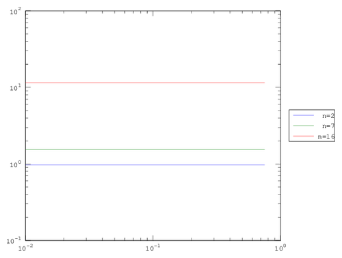
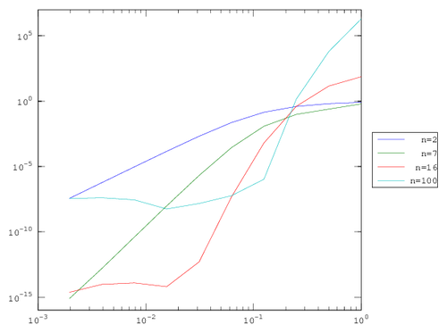
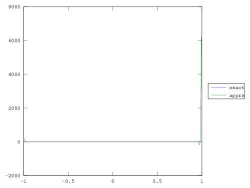
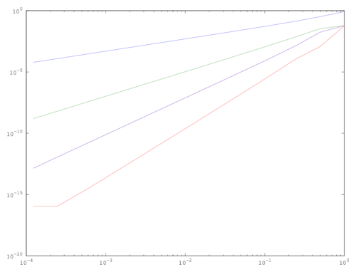
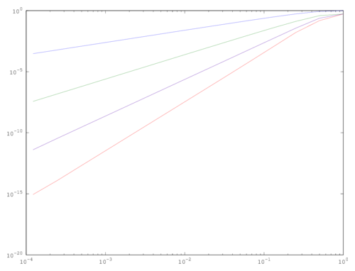

# Math 578 Assignment 1 

## Dan Anderson - 260457325 - Fall 2016

## Question 2

### Signum function

For all polynomial degrees the order of error was constant with respect to h.
This is reasonable; the discontinuity at 0 affects the $sup$ norm strongly. 

### Sine

The error for sine showed good agreement with the theory, until it reached our 
effective machine epsilon around $10^{-16}$. The order of the error was about
$h^3$, $h^9$, and $h^17$ for the degree 2, 7, and 16 polynomial interpolations.
Note that the degree 16 converged rapidly the machine epsilon, so we needed to 
toss out many small h-values to obtain the 'true' order of error.

### Absolute value

The absolute value had order $h$ convergence for all degrees. This agrees with
the theory because abs is in $C^0$ but not $C^1$.

### Quintic

At first glance, this is garbage. The error should obviously plummet to 0 for
the degree 7 and 16 polynomials. However, there is some itsy-bitsy instability
in the calculation of the coefficients for $P^n$, hence we pick up some rounding
error.

\newpage

## Question 3

### Equidistant

Behold! We observe the Runge phenomenon for large $n$: more equidistant points fail
to guarantee convergence if the derivatives of a function are poorly behaved. Note,
however, that error still decreases with respect to $h$.

  h            n=2          n=7          n=16         n=100
  ------------ ------------ ------------ ------------ ------------
  1.0000e+00   8.0957e-01   6.1306e-01   7.3637e+01   1.9667e+06
  5.0000e-01   6.4491e-01   2.4631e-01   1.4373e+01   6.2507e+03
  2.5000e-01   3.9445e-01   9.6406e-02   4.0398e-01   1.4555e+00
  1.2500e-01   1.4045e-01   1.2113e-02   6.3266e-04   1.0609e-06
  6.2500e-02   2.3066e-02   2.7710e-04   4.6669e-08   5.8000e-08
  3.1250e-02   2.0714e-03   2.0345e-06   4.9116e-13   1.4652e-08
  1.5625e-02   1.4353e-04   9.4982e-09   6.2172e-15   5.5565e-09
  7.8125e-03   9.2139e-06   3.8854e-11   1.2212e-14   2.8005e-08
  3.9062e-03   5.7977e-07   1.5343e-13   9.3259e-15   4.0407e-08
  1.9531e-03   3.6297e-08   7.7716e-16   2.3315e-15   3.5323e-08

  : Errors for n-degree interpolants of Runge function, varying with h.

### Chebyshev

Sampling the Chebyshev nodes should guarantee convergence of the $sup$
norm with respect to $n$; below, we largely see that trend hold, except
in the upper right hand corner. This is attributable to roundoff error
from a poorly conditioned for large n

  h            n=2          n=7          n=16         n=100
  ------------ ------------ ------------ ------------ ------------
  1.0000e+00   7.8366e-01   7.4327e-01   1.8882e-01   *1.6040e-01*
  5.0000e-01   5.9990e-01   3.9059e-01   3.2580e-02   2.2293e-03
  2.5000e-01   3.3651e-01   8.7943e-02   1.3095e-03   2.4638e-07
  1.2500e-01   1.0967e-01   5.6849e-03   3.8888e-06   4.7828e-13
  6.2500e-02   2.1216e-02   9.1388e-05   5.4007e-10   1.1102e-15
  3.1250e-02   2.0238e-03   5.8748e-07   7.6605e-15   4.6629e-15
  1.5625e-02   1.4284e-04   2.6401e-09   4.4409e-16   3.4417e-15
  7.8125e-03   9.2145e-06   1.0700e-11   3.3307e-16   1.9984e-15
  3.9062e-03   5.8053e-07   4.2299e-14   4.4409e-16   3.9968e-15
  1.9531e-03   3.6356e-08   3.3307e-16   2.2204e-16   8.5487e-15

  : Errors for various n-degree Chebyshev interpolants of Runge
  function, varying with h.

\newpage

## Question 4

Briefly put, you can't make chicken pie out of chicken feed. Regardless
of the method chosen, irregular functions like signum and abs will not
be well-approximated by a polynomial scheme, and their order of convergence
is independent of the polynomial degree past their level of continuity. Smooth
functions with bounded derivatives like $sin$ and $x^5$ behave nicely, and
converge more quickly with higher-degree schemes (nearest < linear < cubic < spline).

I suppose the only two points of interest are that `pchip` is the same as `cubic`[^1] 
and `spline` yielded quicker convergence than the `cubic`. Consulting the documentation,
`spline` to MATLAB means matching 2nd derivatives as well as the first; which means we
should expect order 7 convergence from `spline`. Digging through the raw numbers doesn't
clarify things much, as in no case do we run up against the machine epsilon in such a way
as to throw off the line of best fit.

Truly, mysterious.

  function   nearest    linear     spline     pchip      cubic
  ---------- ---------- ---------- ---------- ---------- ----------
  signum     NaN        0.012206   0.014586   0.018865   0.018865
  sine       1.036637   1.993232   3.907034   3.019374   3.019374
  abs        1.044457   1.056662   1.081153   1.056662   1.056662
  quintic    0.944555   1.912727   3.914612   2.933812   2.933812
  runge      0.970954   1.893706   3.857821   1.895098   1.895098

  : Slope of best-fit line for various functions and interpolation
  methods.

[^1]: indeed, consult <http://blogs.mathworks.com/cleve/2012/07/16/splines-and-pchips/>.

\newpage

## Question 5

### Part 1

$$
A = 
\begin{bmatrix}{A}
1 & 1 & 1 & 1 \\
3 & 2 & 1 & 0 \\
-1 & 1 & -1 & 1 \\
3 & -2 & 1 & 0 \\
\end{bmatrix}
$$

$$
A^1 = \frac{1}{4}
\begin{bmatrix}{A}
1 & 1 & 1 & 1 \\
3 & 2 & 1 & 0 \\
-1 & 1 & -1 & 1 \\
3 & -2 & 1 & 0 \\
\end{bmatrix}
$$

### Part 2

### Part 3

