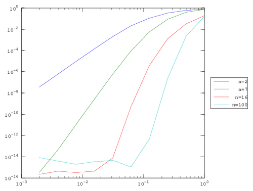
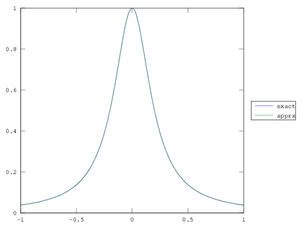
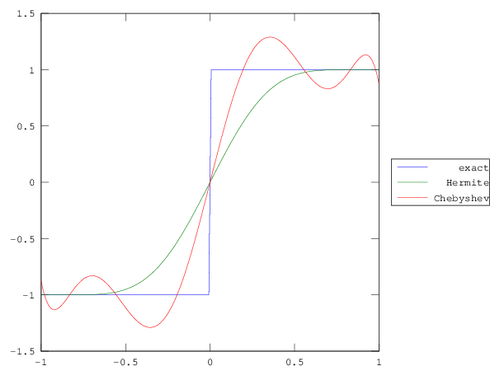

Question 2
----------

### Signum function

For all polynomial degrees the order of error was constant with respect to h.
This is reasonable; the discontinuity at 0 is poorly approximated by continous
functions, especially with respect to the $sup$ norm. 

### Sine

The error for sine showed good agreement with the theory, until it reached our 
effective machine epsilon around $10^{-16}$. The order of the error was about
$h^3$, $h^9$, and $h^{17}$ for the degree 2, 7, and 16 polynomial interpolations.
Note that the degree 16 converged rapidly the machine epsilon, so we needed to 
toss out many small h-values to obtain the 'true' order of error.

### Absolute value

The absolute value had order $h$ convergence for all degrees. This agrees with
the theory: `abs` is in $C^0$ but not $C^1$.

### Quintic

At first glance, this is garbage. The error should obviously plummet to 0 for
the degree 7 and 16 polynomials. However, there is some itsy-bitsy instability
in the calculation of the coefficients for $P^n$, hence we pick up some rounding
error. 

\newpage

Question 3
----------

### Equidistant

Behold! We observe the Runge phenomenon for large $n$: more equidistant points fail
to guarantee convergence if the derivatives of a function are poorly behaved. Note,
however, that error still decreases with respect to $h$, up to some lower bound
determined by the condition of the matrix.

  h            n=2          n=7          n=16         n=100
  ------------ ------------ ------------ ------------ ------------
  1.0000e+00   8.0957e-01   6.1306e-01   7.3637e+01   1.9667e+06
  5.0000e-01   6.4491e-01   2.4631e-01   1.4373e+01   6.2507e+03
  2.5000e-01   3.9445e-01   9.6406e-02   4.0398e-01   1.4555e+00
  1.2500e-01   1.4045e-01   1.2113e-02   6.3266e-04   1.0609e-06
  6.2500e-02   2.3066e-02   2.7710e-04   4.6669e-08   5.8000e-08
  3.1250e-02   2.0714e-03   2.0345e-06   4.9116e-13   1.4652e-08
  1.5625e-02   1.4353e-04   9.4982e-09   6.2172e-15   5.5565e-09
  7.8125e-03   9.2139e-06   3.8854e-11   1.2212e-14   2.8005e-08
  3.9062e-03   5.7977e-07   1.5343e-13   9.3259e-15   4.0407e-08
  1.9531e-03   3.6297e-08   7.7716e-16   2.3315e-15   3.5323e-08

  : Errors for n-degree interpolants of Runge function, wrt. h.

### Chebyshev

Sampling the Chebyshev nodes should guarantee convergence of the $sup$
norm with respect to $n$; below, we largely see that trend holds, except
in the upper right hand corner. This is attributable to roundoff error
from a poorly conditioned matrix for large n.

  h            n=2          n=7          n=16         n=100
  ------------ ------------ ------------ ------------ ------------
  1.0000e+00   7.8366e-01   7.4327e-01   1.8882e-01   **1.6040e-01**
  5.0000e-01   5.9990e-01   3.9059e-01   3.2580e-02   2.2293e-03
  2.5000e-01   3.3651e-01   8.7943e-02   1.3095e-03   2.4638e-07
  1.2500e-01   1.0967e-01   5.6849e-03   3.8888e-06   4.7828e-13
  6.2500e-02   2.1216e-02   9.1388e-05   5.4007e-10   1.1102e-15
  3.1250e-02   2.0238e-03   5.8748e-07   7.6605e-15   4.6629e-15
  1.5625e-02   1.4284e-04   2.6401e-09   4.4409e-16   3.4417e-15
  7.8125e-03   9.2145e-06   1.0700e-11   3.3307e-16   1.9984e-15
  3.9062e-03   5.8053e-07   4.2299e-14   4.4409e-16   3.9968e-15
  1.9531e-03   3.6356e-08   3.3307e-16   2.2204e-16   8.5487e-15

  : Errors for various n-degree Chebyshev interpolants of Runge
  function, wrt. h.

\newpage

Question 4
----------

  function   nearest    linear     spline     pchip      cubic
  ---------- ---------- ---------- ---------- ---------- ----------
  signum     NaN        0.012206   0.014586   0.018865   0.018865
  sine       1.036637   1.993232   3.907034   3.019374   3.019374
  abs        1.044457   1.056662   1.081153   1.056662   1.056662
  quintic    0.944555   1.912727   3.914612   2.933812   2.933812
  runge      0.970954   1.893706   3.857821   1.895098   1.895098

  : Slope of best-fit line for various functions and interpolation
  methods.

Briefly put, you can't make chicken pie out of chicken feed. Regardless
of the method chosen, irregular functions like signum and abs will not
be well-approximated by a polynomial scheme, and their order of
convergence is independent of the polynomial degree past their level of
continuity. Smooth functions with bounded derivatives like $sin$ and
$x^5$ behave nicely, and converge more quickly with higher-degree
schemes (nearest \< linear \< cubic \< spline).

There are a few points of interest. One is that `pchip` is an alias for
`cubic`[^1]. The other is that `pchip` did not give $O(h^4)$
convergence, while the the 'true' spline did. This is not due to
numerical screw-up, but an inherent quality of the method. For answers,
we go to the source[^2]. In short: since we do not provide
`interp1` with the derivatives at each grid point, the
`pchip` method estimates them by taking, roughly, a central difference
at each point. This works, but worsens the error compared to the cubic
Hermite interpolant done in class and in quesiton 5, which uses the
exact derivative.

(note: `parabolic` was not supported by my verison of MATLAB; judging by the
docs, I would guess it has about $O(h^3)$ convergence).

[^1]: indeed, consult <http://blogs.mathworks.com/cleve/2012/07/16/splines-and-pchips/>.
[^2]: <https://www.mathworks.com/moler/interp.pdf>

\newpage

Question 5
----------

### Part 1

So we solve one of the given equations and obtain a linear system for each
function: $Ac_i = f_i$, where $c_i$ is the vector of coefficients for the given
polynomial, and $f_i$ is the constraint vector specified in the problem. For example,
the coefficients of $L^{10}$ are given by:

$$
Ac_{L^{10}} = 
\begin{bmatrix}
1 & 1 & 1 & 1 \\
3 & 2 & 1 & 0 \\
-1 & 1 & -1 & 1 \\
3 & -2 & 1 & 0 \\
\end{bmatrix}
\begin{bmatrix}
c_3 \\ c_2 \\ c_1 \\ c_0 \\
\end{bmatrix}
=
\begin{bmatrix}
1 \\ 0 \\ 0 \\ 0 \\
\end{bmatrix}
= f_{L^{10}}
$$

While $R^{11}$ would be given by:

$$
Ac_{R^{11}} = 
\begin{bmatrix}
1 & 1 & 1 & 1 \\
3 & 2 & 1 & 0 \\
-1 & 1 & -1 & 1 \\
3 & -2 & 1 & 0 \\
\end{bmatrix}
\begin{bmatrix}
c_3 \\ c_2 \\ c_1 \\ c_0 \\
\end{bmatrix}
=
\begin{bmatrix}
0 \\ 0 \\ 0 \\ 1 \\
\end{bmatrix}
= f_{R^{11}}
$$

So we invert, solve for $c_i$ of each function, and obtain our Hermite interpolation. 
The computed error is `0.96823` for Hermite, and `0.95035` for Chebyshev.  

### Part 2

Let $G^n(x) = c_nx^n + c_{n-1}x^{n-1} + ... + c_0$ be the generic
polynomial of $n$th degree, and $N=\frac{n}{2}$. Then, the $k$th row of
the $n \times n$ matrix $A^n$ corresponding to our linear system will be
determined by the coefficients of $d^{k-1}_x G^n(1)$, for
$1 \leq k \leq N$, and $d^{k-1-N}_x G^n(-1)$, for $N+1 \leq k \leq n$.
Explicitly,

$$
a^n_{ij} = \begin{cases}
0 & n-j-i+1 < 0  \text{ and } i \leq N \\
\frac{(n-j)!}{(n-j-i+1)!}   & i \leq N \\
0 & n-j-i+N+1 < 0  \text{ and } i > N \\
(-1)^{i-N+1+j}\frac{(n-j)!}{(n-j-i+1+N)!}& i > N \\
\end{cases}
$$

The constraint vectors follow naturally: let $L^i$ be the function for
the $i$th derivative on the left, and $R^i$ for the $i$th derivative on
the right. Then, $R^i = \delta_{ij}$ and $L^i = \delta_{N+i,j}$.

### Part 3

As expected, the error remains constant for all degrees of the interpolants.
This is a failing of the $sup$ norm; it is a local measure (essentially, the residual
at 0) when what we probably want is something global, like $L^1$.

  degree   Hermite error   Chebyshev error
  -------- --------------- -----------------
  3        0.96823         0.95035
  5        0.97515         0.95529
  7        0.97890         0.95742
  9        0.98135         0.95862
  11       0.98311         0.95939

  : Error of Hermite and Chebyshev interpolation for various degrees.

\newpage

Code
----

See <http://github.com/mxork/numerics> for code.
