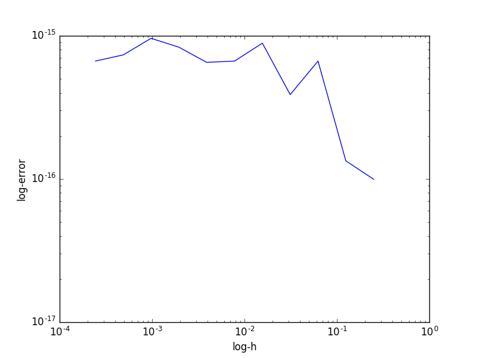
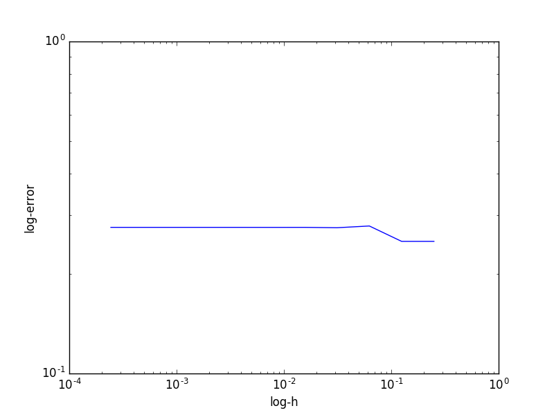
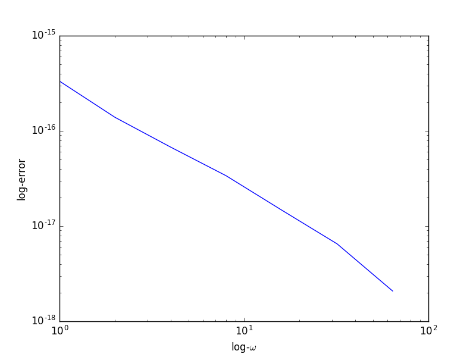

# Question 1

## Question 1.1

**1** Plug the exact solution into the scheme, expand out the Taylor series, cancel and collect terms:

**2** Let $u=e^ikx$, sub into the scheme:

**3** Picking $\theta=\frac{1}{2}$ is immediately obvious: it gets us $O(TODO)$ accuracy for no extra cost compared
to any $\theta$ value not equal to 0.

Now, considering the balance of $\delta t$ and $\delta x$, we derive an expression for the product of 
computer runtime, $C$, and error, $E$, which seems to be as good a metric as any.

\begin{align*}
\end{align*}

Hence, we wind up with $\theta=\frac{1}{2}$, and $\delta t = (\delta x)^2

**4**

Mess around with solutions of the form u=sincos TODO

## Question 1.2

**1** get D again

**2** Hideously ugly LTE.

**3** Even uglier stability. 

**4** "modified equation approach..."? Somewhere in notes. Scheme cannot be second order, because 
linear schemes can't be.

## Question 1.3

**1** Assume periodic conditions. Then, we apply TV norm to $u^n+1_i$, crunch out a nice expression for it.
Then, summing over all spatial indices, we have glorious cancellation and TVD.

**2** Follows almost immediately from the linearity of the TV norm.

**3** Is it a convex combination of Euler steps? Yes. So, yes.

**4** TODO

# Question 2

## Question 2.1

**1** Let $u=sin(x)$ and $f=...TODO$.

Does $sin(x)$ count as trivial? Maybe. Regardles, the error is nearly 0 from the get go, since
a sine wave is well-represented by a truncated Fourier series.

## Question 2.2

Gibbs phenomenon.

# Question 3

## Question 3.1

$u = -\omega^2 sin(\omega x)cos(\omega y)$

The error is small since the frequency of our input function $f$ is below the Nyquist limit.

## Question 3.2

Damned if I know. been bashing my head against this one for a while.

## Question 3.3

